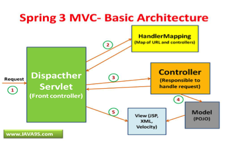

Initial Discussion of Software Architecture and Technology Rationale 
=======================================================================

*Technologies Used*

The programming and mark-up languages that are going to be used in the
project are;

-   Java for the main implementation

-   MySQL for persisting data

-   HTML/JSP for the structure of web pages

-   CSS for the style and layout of the web pages

-   JavaScript/JSP for dynamic web pages

The frameworks that the project will utilise are as follows;

-   OpenStreetMap to generate geological real-time maps

-   Spring MVC to handle HTTP requests

The Spring MVC framework which uses the model, view and controller
design pattern also comes with a lot of added functionality such as the
Spring Security package; this can be utilised for user password
encryption (bcrypt).

Above is a graphical representation of the design pattern which the
Spring MVC framework utilises. Below is a step by step process of how
the framework handles HTTP requests.

1)  The **Dispatcher** object receives a HTTP request

2)  Request pattern matching is delegated to the **HandlerMapping**
    object which returns a controller name and method to execute

3)  The **Dispatcher** then invokes the controller method if it exists
    or throws an appropriate error message if needed.

4)  On invocation the controller will gather necessary data in order to
    return data to **Dispatcher** this is in the form of **Models** and
    **Views**.

5)  The dispatcher receives all required information from the controller
    which is needed to display the response to the user

6)  The **View** is then processed along with **Model** data which forms
    the end user response

*Initial Prototype*

The initial prototype should include most if not all of the key features
of the final web application. It should incorporate the registration
process for the Searchers and Landlords and the login system for all
Administrators, Searchers and Landlords.

Searchers should be able to search for properties which is then
represented on a geographical map along with other important information
pertaining to the property. Additionally, they can express interest in a
property which alerts the landlord of that property that an unspecified
Searcher is interested. A Searcher should also be able to sign up for
the buddy system upon registration, if they do sign up to this service
then they will be recommended prospect buddies of which should be
relevant to the user’s property search criteria and preferences.
Searchers should also be able to message potential buddies and property
landlords.

The prototype should also allow Landlords to register and login. A
Landlord can create, manage and delete a property that they decide to
list. The property listing can contain both written text and property
images. A landlord cannot initially message potential tenants but can
reply if they are directly contacted by Searchers.

Both Searchers and Landlords should be able to submit reports. Reports
deal with the notifying of invalid or inappropriate use of the service
by other users.

Administrators can deal with reports by removing property listings,
deleting users and suspending users.

*Component Diagram*

