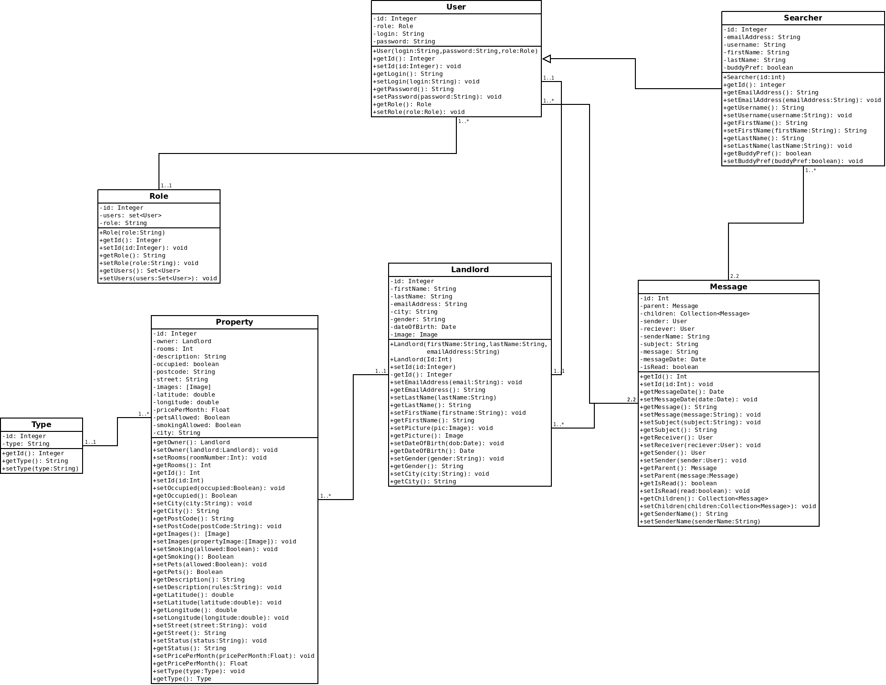
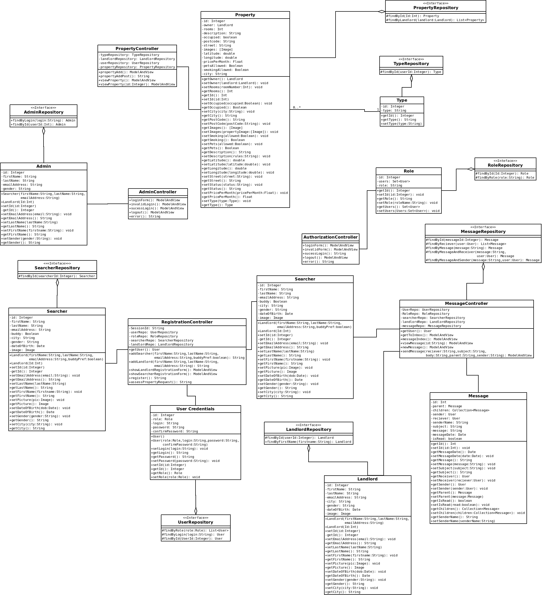
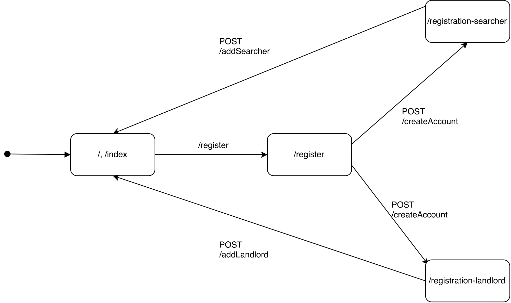

Diagrams
=============

Domain Class Diagram
-------------

This diagram shows the scope of the system, the domain part of the system.
The User object is created when a user creates a new account it holds your username, password, and role. Landlord and Searcher object are to hold personal information such as name, email, this object is created within the web app when the user has created a user object then it would create either a searcher or landlord object based on the user role and take them to the appreciate screen. We broke down the web app into small modular component and these class should support continuous improvement due to the design pattern used. Property class should be able to support Open Street Maps, as each property object will have a latitude and longitude, this means when rendering the maps it would be able to position each property correctly on the map.

Whole System Class Diagram
-------------

This diagram shows the entire system, with all the layers inclusive, the domain, security and controllers are all present in this diagram.

##Security Layer

With the use of each user having role it allows us to allow certain user onto certain pages, we have implemented code which looks at the role of the user and based on that can allow the user to view the page or block the request and send them to an error page.  AuthenticationManager is used for the main aspect of security. Since this web app is going to store personal data we have used secure communication across the web app (https), HttpBasicAuthentication allows us to do this.

Component Diagram
-------------

This diagram models the high-level software components, and also shows the interfaces to those components.

Message Navigational Model
-------------

This model, shows how the message controller works.

Authentication Navigational Model
-------------

This model, shows how the authentication controller works.

Registation Navigational Model
-------------

This model, shows how the Registation controller works.

Database Schema
-------------

CREATE TABLE IF NOT EXISTS `admin` (
  `user_id` int(11) NOT NULL,
  `confirm_email` varchar(255) DEFAULT NULL,
  `confirm_password` varchar(255) DEFAULT NULL,
  `email` varchar(255) DEFAULT NULL,
  `first_name` varchar(255) DEFAULT NULL,
  `last_name` varchar(255) DEFAULT NULL,
  `password` varchar(255) DEFAULT NULL,
  `user_name` varchar(255) DEFAULT NULL
) ENGINE=InnoDB DEFAULT CHARSET=latin1;

CREATE TABLE IF NOT EXISTS `landlord` (
  `id` int(11) NOT NULL,
  `email_address` varchar(255) DEFAULT NULL,
  `first_name` varchar(255) DEFAULT NULL,
  `last_name` varchar(255) DEFAULT NULL
) ENGINE=InnoDB DEFAULT CHARSET=latin1;

CREATE TABLE IF NOT EXISTS `messages` (
  `id` int(11) NOT NULL,
  `is_read` bit(1) DEFAULT NULL,
  `message` varchar(512) DEFAULT NULL,
  `message_date` datetime DEFAULT NULL,
  `sender_name` varchar(255) DEFAULT NULL,
  `subject` varchar(255) DEFAULT NULL,
  `parent_id` int(11) DEFAULT NULL,
  `receiver_id` int(11) DEFAULT NULL,
  `sender_id` int(11) DEFAULT NULL
) ENGINE=InnoDB AUTO_INCREMENT=3 DEFAULT CHARSET=latin1;

CREATE TABLE IF NOT EXISTS `property` (
  `id` int(11) NOT NULL,
  `city` varchar(255) DEFAULT NULL,
  `number` varchar(255) DEFAULT NULL,
  `postcode` varchar(255) DEFAULT NULL,
  `rooms` int(11) DEFAULT NULL,
  `street` varchar(255) DEFAULT NULL,
  `landlord` int(11) DEFAULT NULL,
  `type` int(11) DEFAULT NULL
) ENGINE=InnoDB DEFAULT CHARSET=latin1;

CREATE TABLE IF NOT EXISTS `role` (
  `id` int(11) NOT NULL,
  `role` varchar(255) DEFAULT NULL
) ENGINE=InnoDB DEFAULT CHARSET=latin1;

CREATE TABLE IF NOT EXISTS `searcher` (
  `id` int(11) NOT NULL,
  `buddy_pref` bit(1) NOT NULL,
  `email_address` varchar(255) DEFAULT NULL,
  `first_name` varchar(255) DEFAULT NULL,
  `last_name` varchar(255) DEFAULT NULL
) ENGINE=InnoDB DEFAULT CHARSET=latin1;

CREATE TABLE IF NOT EXISTS `type` (
  `id` int(11) NOT NULL,
  `type` varchar(255) DEFAULT NULL
) ENGINE=InnoDB AUTO_INCREMENT=3 DEFAULT CHARSET=latin1;

CREATE TABLE IF NOT EXISTS `user` (
  `id` int(11) NOT NULL,
  `login` varchar(255) DEFAULT NULL,
  `password` varchar(255) DEFAULT NULL,
  `role` int(11) DEFAULT NULL
) ENGINE=InnoDB AUTO_INCREMENT=3 DEFAULT CHARSET=latin1;

We have used MySQL to save data, above is the database schema. We have used Hibernate for the persistence layer making use of object relational mapping to easily query databases using SQL and set up the structure. 
