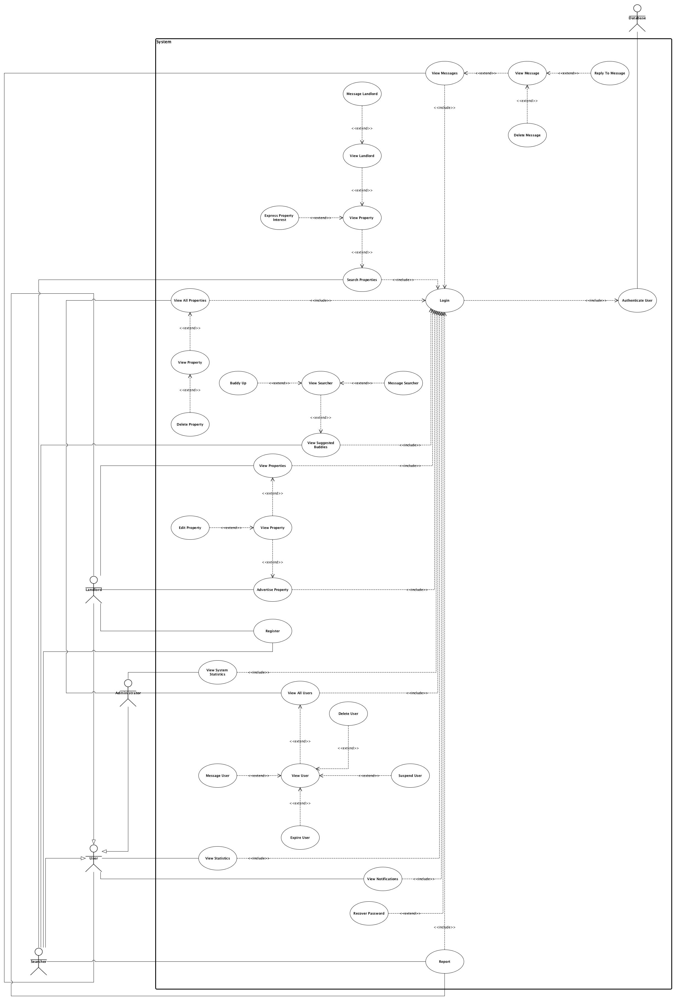

#Design Documents

##Use Case Diagram

A use case diagram can be summarised in four points:

The boundary, which defines the system of interest in relation to the world around it.
The actors, usually individuals involved with the system defined according to their roles.
The use cases, which are the specific roles played by the actors within and around the system.
The relationships between and among the actors and the use cases.

##Component Diagram

Shows all the components in the MVC architecture.

##Spring MVC Basic Architecture

The Spring MVC framework which uses the model, view and controller design pattern also comes with a lot of added functionality such as the Spring Security package; 
this can be utilised for user password encryption (bcrypt).
Above is a graphical representation of the design pattern which the Spring MVC framework utilises. Below is a step by step process of how the framework handles HTTP requests.

1) The Dispatcher object receives a HTTP request

2) Request pattern matching is delegated to the HandlerMapping object which returns a controller name and method to execute

3) The Dispatcher then invokes the controller method if it exists or throws an appropriate error message if needed.

4) On invocation the controller will gather necessary data in order to return data to Dispatcher this is in the form of Models and Views.

5) The dispatcher receives all required information from the controller which is needed to display the response to the user

6) The View is then processed along with Model data which forms the end user response

##Technology Design Decisions Overview

During the design phase of the application it was concluded that the following technologies and tools would be used to develop the application and for the relevant reasons.
•	JAVA – This is the primary programming language that will be used to develop the backend of the application. It has been unanimously agreed upon that Java will be the primary language used to develop the application for various reasons. Firstly, Java is a powerful and capable programming language and offers the huge advantage of being platform independent meaning that the application can be run on different operating systems with little to no adjustments. Additionally, Java was chosen as the primary language due to the simple fact that the developers were most comfortable with Java as they have all had a significant amount of experience with Java. The backend of the 

•	JSP has been used to create views for the frontend of the web application

•	HTML is the mark-up language that will be used to develop the front end of the web application. Similarly to Java, the developers were very comfortable using this language to create the skeleton of the frontend. Conjoined with the fact that there are no widespread alternatives to HTML it makes most sense to simply use HTML. 

•	CSS will be used in addition to HTML to stylize webpages so that they are more presentable to the end user and more aesthetically pleasing. CSS is also something everyone participating in the creation of the web app is familiar with. 

•	MySQL is a relational database management system which will be used to organise and store critical application information. For instance, the logins and matching passwords of registered users as well as property details.
•	Dia – is a diagram creation tools which will be used during the design phase to draw up UML diagrams. This makes drawing up the diagrams more efficient opposed to drawing them by hand as it reduces chances of errors. This could ultimately cause a misunderstanding in intention between developers and the designers.

•	Draw.io is a similar tool to Dia. This can be used as an alternative to Dia as it is not OS restricted.

•	UML – Unified modelling language was heavily used in the design phase to model real-world aspects of the application. The following diagrams have been generated to represent the system:
o	Use case diagram to describe the requirements of the system
o	Component Diagram has been used to model high-level software component of the application and the interfaces of those components.
o	The domain class diagram to show the entire scope and the domain of the system.
o	Navigation Models have been used in order to lay out the frontend navigation of the system.

##Security and Performance

In this section the security measurements considered will be discussed. All technologies and tools listed have been considered and discussed but may ultimately not have been implemented due to lack of expertise and/or time

Secure Socket Layer (SSL) is currently the standard and widely applied security technology to encrypt established links between web servers and end-user’s web browsers.  This allows any data transferred to be protected from third party interception. SSL is a must due to the nature of the data being transferred (named, addressed, phone numbers etcetera). This has been implemented because it is considered a standard security measurement.

Abstraction has been used to hide irrelevant data about an object. This has been done in order to increase efficiency and reduce complexity of the system. 

Password Encryption has been applied to further secure passwords
Password policies have been applied to encourage end-users to use strong passwords. This makes it much more difficult to brute force or simply guess people’s passwords by enforcing a minimum character length requirement and combination of letters numbers and upper-case letters. 

Field masking has been applied to appropriate fields. For instance, the input on the password field on the login view has been masked for security purposes.

Access control has been applied on different levels. For instance, unauthorised users are not allowed to access the database. Likewise, on the frontend of things end-users are not able to see views they’re not intended to see. Searchers are not able to access the inbox of other searchers, they cannot edit a landlord’s property etc. 

Strong input validation has been set in place in order to prevent SQL injection and 
User Authentication has been used so that only authorised users can have access to certain services.

##Domain Class Diagram

This diagram shows the scope of the system, the domain part of the system. The User object is created when a user creates a new account 
it holds your username, password, and role. Landlord and Searcher object are to hold personal information such as name, email, this object 
is created within the web app when the user has created a user object then it would create either a searcher or landlord object based on 
the user role and take them to the appropriate screen. 

##Message Navigational Model

##Authentication Navigational Model

##Registation Navigational Model

These navigational models show how the user interacts with the system

##Database Schema

This schema shows all of the tables in the database, their contents and how they interact with one another. 

This class diagram shows the entire project in UML notation 

