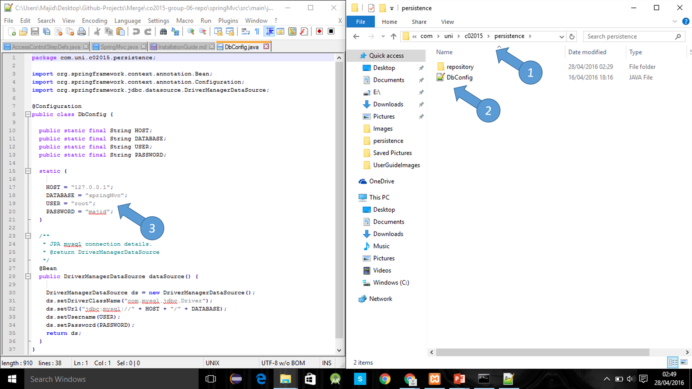

# User Guide

## Locally Installing Web App

1. Clone Repository     
2. Install XAMPP or any other Apache distribution  (https://www.apachefriends.org/index.html)  
3. Download Gradle (http://gradle.org/)   
4. Change Database Configuration file
 
Go to the cloned repository folder then springMvc -> Src -> main -> java -> com -> uni ->  c02015 -> persistence -> DbConfig.java  
Click on DbConfig.java        
Change username and password according, if you have installed a fresh version of XAMPP username is root and password is empty so ""
5. Open terminal and go to cloned repository folder 
6. Then go into springMvc (cd springMvc)
7. Go to XAMPP turn on Apache and Tomcat Server   
8. Then run gradelBootRun  

 

 

